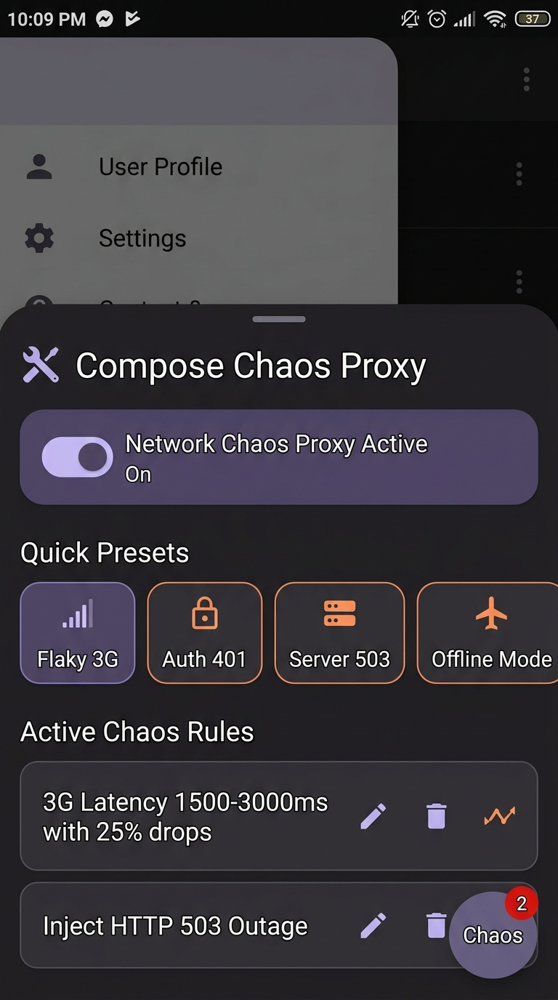

# 🌪️ compose-chaos-proxy

[](LICENSE)
[](https://kotlinlang.org)
[](https://developer.android.com)

> **On-Device Network & Latency Chaos Simulator with Jetpack Compose Debug UI Overlay for Android.**

`compose-chaos-proxy` is a developer tool and OkHttp interceptor that allows mobile developers, QA engineers, and automated tests to inject **network latency, synthetic HTTP status codes (401, 403, 404, 429, 500, 503), dropped connections, and timeouts** directly on-device without configuring desktop proxy software (Charles, Proxyman, mitmproxy).

<p align="center">
  
</p>

---

## ✨ Features

- ⏱️ **Configurable Latency Injection**: Add artificial delay (min/max ms with random jitter) to simulate 2G/3G/4G network conditions on specific URL patterns.
- 🚨 **Synthetic HTTP Status Codes**: Intercept requests and return mock HTTP 401 (Auth Expired), 429 (Rate Limited), 500 (Internal Error), or 503 (Service Outage) with custom JSON error bodies.
- 🔌 **Connection Dropper**: Simulate `SocketTimeoutException` and offline mode to test app retry and recovery mechanisms.
- 🎛️ **Quick Presets**: 1-tap presets for *Flaky 3G Network*, *Auth Expired (401)*, *Server Outage (503)*, *Rate Limited (429)*, and *Offline Mode*.
- 📱 **Jetpack Compose Floating Overlay**: Draggable floating badge and expandable Material 3 bottom-sheet with master kill switch, custom rule builder, and live intercepted event logs.
- ⚡ **Zero-Config OkHttp Interceptor**: Drop `ComposeChaosInterceptor()` into your `OkHttpClient`.

---

## 📦 Installation

Add JitPack to your `settings.gradle.kts`:

```kotlin
repositories {
    maven { url = uri("https://jitpack.io") }
}
```

Add the dependency to your app's `build.gradle.kts`:

```kotlin
dependencies {
    implementation("com.github.zakayothuku:compose-chaos-proxy:v1.0.0")
}
```

---

## 🚀 Quickstart

### 1. Attach OkHttp Interceptor

```kotlin
val okHttpClient = OkHttpClient.Builder()
    .addInterceptor(ComposeChaosInterceptor())
    .build()
```

### 2. Attach Floating Compose UI Overlay

Add `ComposeChaosOverlay()` inside your top-level Jetpack Compose `Surface` or `Scaffold`:

```kotlin
@Composable
fun MainScreen() {
    Box(modifier = Modifier.fillMaxSize()) {
        YourAppContent()

        // Attach floating Chaos Proxy debug badge & bottom sheet
        ComposeChaosOverlay()
    }
}
```

---

## 🛠️ Programmatic Rule Configuration (for UI & Automation Tests)

You can also configure chaos rules programmatically in automated Espresso / UI tests:

```kotlin
// Inject 2000ms delay on all authentication routes
ChaosConfigRepository.addRule(
    ChaosRule(
        name = "Auth Latency",
        urlPattern = ".*/api/v1/auth/.*",
        minDelayMs = 2000,
        maxDelayMs = 3000,
        failureProbabilityPercent = 100
    )
)

// Activate built-in Flaky 3G preset
ChaosConfigRepository.applyPreset(ChaosPresetType.FLAKY_3G)

// Master kill-switch
ComposeChaosInterceptor.setEnabled(false)
```

---

## 🧪 Testing

Run library unit tests:

```bash
./gradlew :library:test
```

Build sample application:

```bash
./gradlew :app:assembleDebug
```

---

## 📄 License & Author

Developed & maintained by **Zakayo Thuku** ([@zakayothuku](https://github.com/zakayothuku)).

```
MIT License - Copyright (c) 2026 Zakayo Thuku
```
